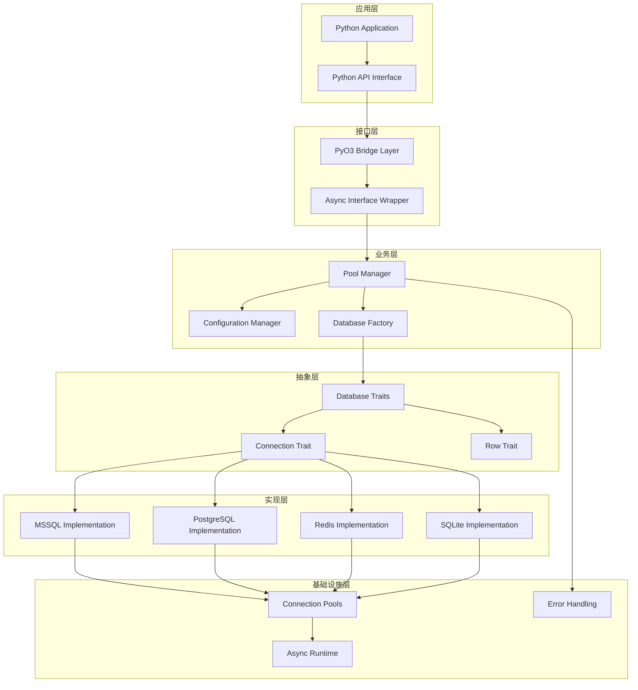
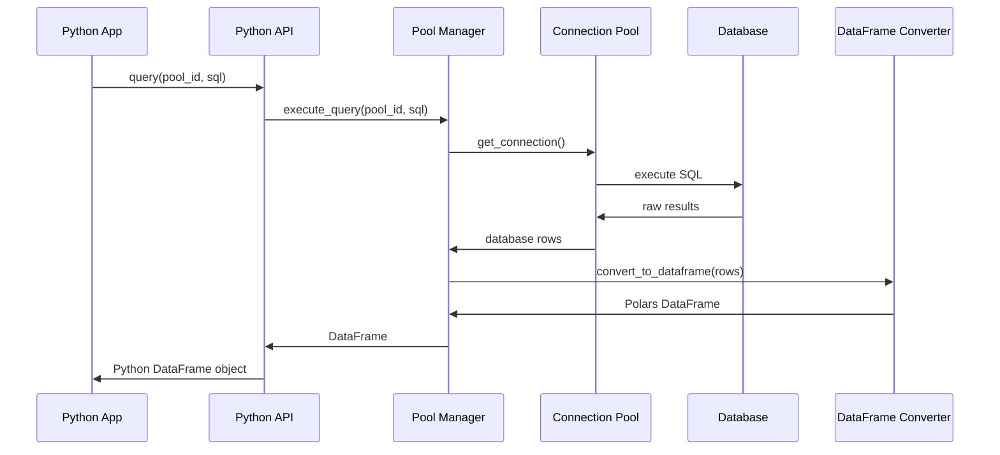

# 工业级数据库连接池技术方案

## 🎯 项目概述

基于 Rust + PyO3 的高性能异步数据库连接池框架，支持多种数据库类型，提供 Python 友好的接口，数据自动转换为 Polars DataFrame。

## 📁 项目结构

```
db-pool-rs/
├── pyproject.toml              # UV + Maturin 配置
├── Cargo.toml                  # Rust 依赖配置
├── uv.lock                     # UV 锁定文件
├── README.md                   # 项目文档
├── .gitignore
├── src/
│   ├── lib.rs                  # PyO3 主入口
│   ├── core/
│   │   ├── mod.rs             # 核心模块
│   │   ├── config.rs          # 统一配置管理
│   │   ├── pool_manager.rs    # 全局连接池管理器
│   │   ├── error.rs           # 错误类型定义
│   │   └── types.rs           # 通用类型
│   ├── databases/
│   │   ├── mod.rs             # 数据库模块入口
│   │   ├── traits.rs          # 数据库抽象特征
│   │   ├── factory.rs         # 数据库工厂模式
│   │   ├── mssql/
│   │   │   ├── mod.rs         # MSSQL 模块
│   │   │   ├── config.rs      # MSSQL 配置
│   │   │   ├── connection.rs  # MSSQL 连接实现
│   │   │   ├── pool.rs        # MSSQL 连接池
│   │   │   ├── types.rs       # MSSQL 类型转换
│   │   │   └── row.rs         # MSSQL 行数据
│   │   ├── postgresql/        # PostgreSQL 支持
│   │   │   ├── mod.rs
│   │   │   ├── config.rs
│   │   │   ├── connection.rs
│   │   │   └── types.rs
│   │   ├── redis/             # Redis 支持
│   │   │   └── mod.rs
│   │   ├── sqlite/            # SQLite 支持
│   │   │   └── mod.rs
│   │   └── influxdb/          # InfluxDB 支持
│   │       └── mod.rs
│   ├── utils/
│   │   ├── mod.rs             # 工具模块
│   │   ├── dataframe.rs       # DataFrame 转换工具
│   │   ├── async_runtime.rs   # 异步运行时管理
│   │   └── validation.rs      # 数据验证工具
│   └── python/
│       ├── mod.rs             # Python 接口模块
│       ├── pool.rs            # Python 连接池类
│       ├── connection.rs      # Python 连接类
│       └── exceptions.rs      # Python 异常类
├── tests/
│   ├── integration/
│   │   ├── test_mssql.rs
│   │   ├── test_postgresql.rs
│   │   └── common/
│   │       └── mod.rs
│   └── unit/
│       ├── test_pool_manager.rs
│       └── test_config.rs
├── examples/
│   ├── python/
│   │   ├── basic_usage.py
│   │   ├── async_usage.py
│   │   ├── multi_db_usage.py
│   │   └── benchmark.py
│   └── rust/
│       └── standalone.rs
├── docs/
│   ├── api.md
│   ├── configuration.md
│   ├── performance.md
│   └── extending.md
└── scripts/
    ├── setup_dev.sh
    ├── run_tests.sh
    └── build_release.sh
```

## 🚀 开发环境设置

### 环境要求

- Python 3.8+
- Rust 1.70+
- UV (Python 包管理器)

### 快速开始

```bash
# 1. 安装 UV (如果未安装)
curl -LsSf https://astral.sh/uv/install.sh | sh

# 2. 克隆项目
git clone <repository-url>
cd db-pool-rs

# 3. 初始化开发环境
uv sync

# 4. 开发模式构建和安装
uv run maturin develop

# 5. 运行测试
uv run pytest tests/

# 6. 运行示例
uv run python examples/python/basic_usage.py
```

### 开发工作流

```bash
# 开发模式 - 自动重新编译
uv run maturin develop --release

# 运行 Rust 测试
cargo test

# 运行 Python 测试
uv run pytest

# 性能基准测试
uv run python examples/python/benchmark.py

# 构建 wheel 包
uv run maturin build --release

# 发布到 PyPI
uv run maturin publish
```

## 🏗️ 核心架构设计

### 1. 分层架构



### 2. 数据流设计



## 🔧 核心组件设计

### 1. 配置系统

```rust
// 支持多种配置方式
#[derive(Debug, Clone)]
pub enum DatabaseConfig {
    MSSQL(MSSQLConfig),
    PostgreSQL(PostgreSQLConfig),
    Redis(RedisConfig),
    SQLite(SQLiteConfig),
    InfluxDB(InfluxDBConfig),
}

// 统一配置接口
pub trait ConfigManager {
    fn from_url(url: &str) -> Result<Self>;
    fn from_dict(dict: HashMap<String, String>) -> Result<Self>;
    fn from_env() -> Result<Self>;
    fn validate(&self) -> Result<()>;
}
```

### 2. 连接池管理

```rust
// 全局连接池管理器
pub struct PoolManager {
    pools: DashMap<String, Box<dyn DatabasePool>>,
    runtime: tokio::runtime::Handle,
    metrics: Arc<PoolMetrics>,
}

// 支持的操作
impl PoolManager {
    pub async fn create_pool(&self, id: String, config: DatabaseConfig) -> Result<()>;
    pub async fn remove_pool(&self, id: &str) -> Result<()>;
    pub async fn get_pool_status(&self, id: &str) -> Result<PoolStatus>;
    pub async fn execute_query(&self, id: &str, sql: &str) -> Result<DataFrame>;
    pub async fn execute_batch(&self, id: &str, sqls: Vec<String>) -> Result<Vec<DataFrame>>;
    pub fn list_pools(&self) -> Vec<String>;
    pub fn get_metrics(&self) -> PoolMetrics;
}
```

### 3. 数据库抽象

```rust
#[async_trait]
pub trait DatabaseConnection {
    type Config: DatabaseConfig;
    type Pool: Send + Sync + Clone;
    type Row: DatabaseRow;

    // 核心操作
    async fn create_pool(config: &Self::Config) -> Result<Self::Pool>;
    async fn execute_query(pool: &Self::Pool, sql: &str) -> Result<Vec<Self::Row>>;
    async fn execute_non_query(pool: &Self::Pool, sql: &str) -> Result<u64>;
    async fn execute_transaction(pool: &Self::Pool, sqls: Vec<String>) -> Result<Vec<u64>>;

    // 数据转换
    fn rows_to_dataframe(rows: Vec<Self::Row>) -> Result<DataFrame>;

    // 监控
    fn pool_status(pool: &Self::Pool) -> PoolStatus;
    fn health_check(pool: &Self::Pool) -> Result<bool>;
}
```

## 🔌 可扩展性设计

### 1. 数据库扩展机制

**新增数据库支持的步骤：**

```bash
# 1. 创建数据库模块
mkdir src/databases/newdb
touch src/databases/newdb/{mod.rs,config.rs,connection.rs,types.rs}

# 2. 实现核心特征
# - 在 config.rs 中实现 DatabaseConfig
# - 在 connection.rs 中实现 DatabaseConnection
# - 在 types.rs 中实现类型转换

# 3. 注册到工厂
# 在 src/databases/factory.rs 中添加新数据库

# 4. 更新配置
# 在 Cargo.toml 中添加依赖
# 在 pyproject.toml 中添加功能特性
```

**扩展示例：**

```rust
// src/databases/newdb/mod.rs
pub mod config;
pub mod connection;
pub mod types;

use crate::databases::traits::*;
use async_trait::async_trait;

pub struct NewDBConnection;

#[async_trait]
impl DatabaseConnection for NewDBConnection {
    type Config = NewDBConfig;
    type Pool = NewDBPool;
    type Row = NewDBRow;

    // 实现所有必需的方法...
}
```

### 2. 功能扩展点

```rust
// 插件系统接口
pub trait DatabasePlugin: Send + Sync {
    fn name(&self) -> &str;
    fn version(&self) -> &str;
    fn supported_features(&self) -> Vec<DatabaseFeature>;

    // 可选的生命周期钩子
    async fn on_pool_created(&self, pool_id: &str) -> Result<()> { Ok(()) }
    async fn on_query_executed(&self, pool_id: &str, sql: &str) -> Result<()> { Ok(()) }
    async fn on_error(&self, error: &DbPoolError) -> Result<()> { Ok(()) }
}

// 中间件系统
pub trait QueryMiddleware: Send + Sync {
    async fn before_query(&self, sql: &str) -> Result<String>;
    async fn after_query(&self, result: &mut DataFrame) -> Result<()>;
    async fn on_error(&self, error: &DbPoolError) -> Result<()>;
}
```

### 3. 配置扩展

```toml
# pyproject.toml 特性配置
[project.optional-dependencies]
mssql = ["tiberius", "tokio-util"]
postgresql = ["tokio-postgres", "postgres-types"]
redis = ["redis", "tokio"]
sqlite = ["rusqlite", "tokio"]
influxdb = ["influxdb", "tokio"]
all = ["db-pool-rs[mssql,postgresql,redis,sqlite,influxdb]"]

# 开发依赖
dev = ["pytest", "pytest-asyncio", "polars", "pandas"]
benchmark = ["pytest-benchmark", "memory-profiler"]
```

## 📊 性能优化设计

### 1. 连接池优化

```rust
// 智能连接池配置
#[derive(Debug, Clone)]
pub struct PoolConfig {
    pub min_connections: u32,
    pub max_connections: u32,
    pub acquire_timeout: Duration,
    pub idle_timeout: Duration,
    pub max_lifetime: Duration,

    // 自适应配置
    pub auto_scaling: bool,
    pub scale_up_threshold: f32,
    pub scale_down_threshold: f32,
    pub health_check_interval: Duration,
}
```

### 2. 缓存机制

```rust
// 查询结果缓存
pub struct QueryCache {
    cache: DashMap<String, CachedResult>,
    ttl: Duration,
    max_size: usize,
}

// 连接缓存策略
pub enum CacheStrategy {
    LRU,
    LFU,
    TTL(Duration),
    Custom(Box<dyn CachePolicy>),
}
```

### 3. 批处理优化

```rust
// 批量操作支持
impl PoolManager {
    pub async fn execute_batch_parallel(
        &self,
        operations: Vec<BatchOperation>
    ) -> Result<Vec<BatchResult>>;

    pub async fn bulk_insert(
        &self,
        pool_id: &str,
        table: &str,
        data: DataFrame
    ) -> Result<u64>;
}
```

## 🛡️ 错误处理与监控

### 1. 错误处理

```rust
// 分层错误处理
#[derive(thiserror::Error, Debug)]
pub enum DbPoolError {
    #[error("连接错误: {0}")]
    Connection(#[from] ConnectionError),

    #[error("查询错误: {0}")]
    Query(#[from] QueryError),

    #[error("配置错误: {0}")]
    Config(#[from] ConfigError),

    #[error("数据转换错误: {0}")]
    DataConversion(#[from] ConversionError),
}
```

### 2. 监控指标

```rust
// 性能指标收集
#[derive(Debug, Clone)]
pub struct PoolMetrics {
    pub total_connections: AtomicU32,
    pub active_connections: AtomicU32,
    pub query_count: AtomicU64,
    pub query_duration: Histogram,
    pub error_count: AtomicU64,
    pub cache_hit_rate: AtomicF64,
}
```

## 🧪 测试策略

### 1. 测试分层

```bash
# 单元测试
cargo test unit::

# 集成测试
cargo test integration::

# Python 接口测试
uv run pytest tests/python/

# 性能测试
uv run python examples/benchmark.py

# 压力测试
cargo test --release stress::
```

### 2. 测试覆盖

- ✅ 连接池创建和销毁
- ✅ 并发查询处理
- ✅ 错误恢复机制
- ✅ 内存泄漏检测
- ✅ 数据类型转换准确性
- ✅ 异步操作正确性

## 📦 部署与分发

### 1. 构建配置

```toml
# pyproject.toml
[build-system]
requires = ["maturin>=1.0,<2.0"]
build-backend = "maturin"

[project]
name = "db-pool-rs"
description = "高性能异步数据库连接池"
authors = [{name = "Your Name", email = "your.email@example.com"}]
license = {text = "MIT"}
requires-python = ">=3.8"
classifiers = [
    "Development Status :: 4 - Beta",
    "Programming Language :: Rust",
    "Programming Language :: Python :: 3",
    "Programming Language :: Python :: 3.8",
    "Programming Language :: Python :: 3.9",
    "Programming Language :: Python :: 3.10",
    "Programming Language :: Python :: 3.11",
    "Programming Language :: Python :: 3.12",
]

[tool.maturin]
features = ["pyo3/extension-module"]
module-name = "db_pool_rs"
```

### 2. CI/CD 流程

```yaml
# .github/workflows/ci.yml
name: CI
on: [push, pull_request]

jobs:
  test:
    runs-on: ubuntu-latest
    strategy:
      matrix:
        python-version: [3.8, 3.9, "3.10", 3.11, 3.12]

    steps:
      - uses: actions/checkout@v4
      - uses: astral-sh/setup-uv@v1
      - name: Install Rust
        uses: dtolnay/rust-toolchain@stable
      - name: Run tests
        run: |
          uv sync
          uv run maturin develop
          uv run pytest
          cargo test
```

## 🎓 使用示例

### Python 基础用法

```python
import asyncio
from db_pool_rs import DatabasePool

async def main():
    # 创建连接池管理器
    pool = DatabasePool()

    # 创建 MSSQL 连接池
    await pool.create_pool(
        pool_id="mssql_main",
        db_type="mssql",
        host="localhost",
        port=1433,
        database="test_db",
        username="sa",
        password="password123",
        max_connections=20
    )

    # 执行查询
    df = await pool.query("mssql_main", "SELECT * FROM users")
    print(f"查询结果: {df.shape} 行数据")

    # 批量操作
    results = await pool.execute_batch("mssql_main", [
        "INSERT INTO logs VALUES ('info', 'Test log')",
        "UPDATE users SET last_login = GETDATE() WHERE id = 1"
    ])

if __name__ == "__main__":
    asyncio.run(main())
```

## ⚠️ 架构风险评估与缓解策略

### 🔴 高风险项

#### 1. 技术栈复杂性风险
**风险描述**：Rust + PyO3 技术栈学习曲线陡峭，团队技能要求高
**影响程度**：高 - 可能延误开发进度，增加维护成本
**缓解策略**：
```bash
# 提供多种部署模式
./scripts/setup_simple.sh    # 纯 Python 模式（快速原型）
./scripts/setup_balanced.sh  # Python + C扩展模式（平衡性能与复杂度）
./scripts/setup_full.sh      # 完整 Rust 模式（最高性能）
```

#### 2. 单点故障风险
**风险描述**：全局 PoolManager 可能成为性能瓶颈和单点故障
**影响程度**：高 - 系统可用性风险
**缓解策略**：
```rust
// 分布式连接池架构
pub struct DistributedPoolManager {
    local_pools: HashMap<String, LocalPool>,
    coordinator: Option<Arc<PoolCoordinator>>,
    fallback_strategy: FailoverStrategy,
}

pub enum FailoverStrategy {
    LocalOnly,           // 仅使用本地连接池
    ActiveStandby,       // 主备模式
    LoadBalanced,        // 负载均衡模式
}
```

### 🟡 中风险项

#### 3. 可观测性不足
**风险描述**：缺乏完整的监控和调试体系
**影响程度**：中 - 生产环境问题排查困难
**缓解策略**：
```toml
# 增加可观测性依赖
[dependencies]
opentelemetry = "0.21"
tracing = "0.1"
metrics = "0.22"
sentry = { version = "0.31", optional = true }
```

#### 4. 配置管理局限
**风险描述**：缺乏动态配置和热更新机制
**影响程度**：中 - 运维灵活性不足
**缓解策略**：
```rust
// 动态配置系统
pub trait ConfigProvider: Send + Sync {
    async fn watch_changes(&self) -> ConfigStream;
    async fn reload_pool(&self, pool_id: &str) -> Result<()>;
    async fn validate_config(&self, config: &DatabaseConfig) -> Result<()>;
}
```

### 🟢 低风险项

#### 5. 扩展性限制
**风险描述**：插件系统设计过于简单
**影响程度**：低 - 功能扩展可能受限
**缓解策略**：采用更成熟的插件架构模式

## 🛡️ 生产环境保障措施

### 1. 健康检查和自动恢复
```rust
pub struct HealthMonitor {
    checks: Vec<Box<dyn HealthCheck>>,
    recovery_strategies: HashMap<ErrorType, RecoveryStrategy>,
    circuit_breaker: CircuitBreaker,
}

impl HealthMonitor {
    pub async fn continuous_monitoring(&self) {
        // 持续健康检查
        // 自动故障检测
        // 智能恢复策略
    }
}
```

### 2. 性能监控和告警
```rust
pub struct PerformanceMonitor {
    metrics_collector: MetricsCollector,
    alerting: AlertingSystem,
    dashboards: Vec<Dashboard>,
}

// 关键性能指标
pub struct KPIs {
    pub connection_utilization: f64,    // 连接池利用率
    pub query_latency_p99: Duration,    // 99分位延迟
    pub error_rate: f64,                // 错误率
    pub throughput_qps: u64,            // 每秒查询数
}
```

### 3. 容错和降级机制
```rust
pub enum FallbackStrategy {
    RetryWithBackoff { max_attempts: u32, base_delay: Duration },
    CircuitBreaker { failure_threshold: u32, recovery_timeout: Duration },
    Graceful Degradation { read_only_mode: bool, cache_fallback: bool },
    Failover { backup_pools: Vec<String> },
}
```

## 🚀 技术优势

1. **极致性能** - Rust 零成本抽象 + 异步 I/O
2. **内存安全** - Rust 所有权系统确保内存安全
3. **Python 友好** - 原生 Polars DataFrame 支持
4. **高可扩展** - 插件化架构，轻松添加新数据库
5. **生产就绪** - 完整的错误处理、监控、测试体系
6. **风险可控** - 多层风险缓解策略和故障恢复机制

## 📈 优化后的发展路线图

### 🎯 阶段一：风险缓解 (v0.1) - 1-2周
**目标**：解决核心风险，建立基础保障
- ✅ MSSQL 基础支持
- 🔄 多模式部署选项 (simple/balanced/full)
- 🔄 基础监控和健康检查
- 🔄 错误恢复机制实现
- 🔄 简化开发环境设置

### 🏗️ 阶段二：架构优化 (v0.2) - 4-6周  
**目标**：解决单点故障，增强可观测性
- 🔄 分布式连接池重构
- 🔄 OpenTelemetry 集成
- 🔄 动态配置系统
- 🔄 PostgreSQL 支持
- 🔄 性能监控仪表板

### 🚀 阶段三：功能扩展 (v0.3) - 6-8周
**目标**：扩展数据库支持，完善插件系统
- 🔄 Redis/SQLite 支持
- 🔄 智能缓存机制
- 🔄 插件系统重构
- 🔄 批处理优化

### 🎯 阶段四：生产就绪 (v0.4) - 8-10周
**目标**：完善运维工具，性能调优
- 🔄 InfluxDB 支持
- 🔄 自动化运维工具
- 🔄 性能基准测试
- 🔄 文档和培训材料

### 🌟 阶段五：企业级功能 (v1.0) - 持续迭代
**目标**：企业级功能完善
- 🔄 多租户支持
- 🔄 高级安全特性
- 🔄 自动扩缩容
- 🔄 企业级监控集成

## 💡 实施建议

**立即行动**：优先实施阶段一的风险缓解措施，这将为后续发展奠定坚实基础。

**成功指标**：
- 性能：QPS > 10,000，P99延迟 < 5ms
- 可靠性：系统可用性 > 99.9%，MTTR < 5分钟  
- 开发效率：新特性开发周期缩短 50%

这个优化后的方案既保持了技术先进性，又有效控制了实施风险，确保项目能够稳步推进并满足工业级应用需求。
