# 工业级数据库连接池技术方案

## 🎯 项目概述

基于 Rust + PyO3 的高性能异步数据库连接池框架，支持多种数据库类型，提供 Python 友好的接口，数据自动转换为 Polars DataFrame。

## 📁 项目结构

```
db-pool-rs/
├── pyproject.toml              # UV + Maturin 配置
├── Cargo.toml                  # Rust 依赖配置
├── uv.lock                     # UV 锁定文件
├── README.md                   # 项目文档
├── .gitignore
├── src/
│   ├── lib.rs                  # PyO3 主入口
│   ├── core/
│   │   ├── mod.rs             # 核心模块
│   │   ├── config.rs          # 统一配置管理
│   │   ├── pool_manager.rs    # 全局连接池管理器
│   │   ├── error.rs           # 错误类型定义
│   │   └── types.rs           # 通用类型
│   ├── databases/
│   │   ├── mod.rs             # 数据库模块入口
│   │   ├── traits.rs          # 数据库抽象特征
│   │   ├── factory.rs         # 数据库工厂模式
│   │   ├── mssql/
│   │   │   ├── mod.rs         # MSSQL 模块
│   │   │   ├── config.rs      # MSSQL 配置
│   │   │   ├── connection.rs  # MSSQL 连接实现
│   │   │   ├── pool.rs        # MSSQL 连接池
│   │   │   ├── types.rs       # MSSQL 类型转换
│   │   │   └── row.rs         # MSSQL 行数据
│   │   ├── postgresql/        # PostgreSQL 支持
│   │   │   ├── mod.rs
│   │   │   ├── config.rs
│   │   │   ├── connection.rs
│   │   │   └── types.rs
│   │   ├── redis/             # Redis 支持
│   │   │   └── mod.rs
│   │   ├── sqlite/            # SQLite 支持
│   │   │   └── mod.rs
│   │   └── influxdb/          # InfluxDB 支持
│   │       └── mod.rs
│   ├── utils/
│   │   ├── mod.rs             # 工具模块
│   │   ├── dataframe.rs       # DataFrame 转换工具
│   │   ├── async_runtime.rs   # 异步运行时管理
│   │   └── validation.rs      # 数据验证工具
│   └── python/
│       ├── mod.rs             # Python 接口模块
│       ├── pool.rs            # Python 连接池类
│       ├── connection.rs      # Python 连接类
│       └── exceptions.rs      # Python 异常类
├── tests/
│   ├── integration/
│   │   ├── test_mssql.rs
│   │   ├── test_postgresql.rs
│   │   └── common/
│   │       └── mod.rs
│   └── unit/
│       ├── test_pool_manager.rs
│       └── test_config.rs
├── examples/
│   ├── python/
│   │   ├── basic_usage.py
│   │   ├── async_usage.py
│   │   ├── multi_db_usage.py
│   │   └── benchmark.py
│   └── rust/
│       └── standalone.rs
├── docs/
│   ├── api.md
│   ├── configuration.md
│   ├── performance.md
│   └── extending.md
└── scripts/
    ├── setup_dev.sh
    ├── run_tests.sh
    └── build_release.sh
```

## 🚀 开发环境设置

### 环境要求

- Python 3.8+
- Rust 1.70+
- UV (Python 包管理器)

### 快速开始

```bash
# 1. 安装 UV (如果未安装)
curl -LsSf https://astral.sh/uv/install.sh | sh

# 2. 克隆项目
git clone <repository-url>
cd db-pool-rs

# 3. 初始化开发环境
uv sync

# 4. 开发模式构建和安装
uv run maturin develop

# 5. 运行测试
uv run pytest tests/

# 6. 运行示例
uv run python examples/python/basic_usage.py
```

### 开发工作流

```bash
# 开发模式 - 自动重新编译
uv run maturin develop --release

# 运行 Rust 测试
cargo test

# 运行 Python 测试
uv run pytest

# 性能基准测试
uv run python examples/python/benchmark.py

# 构建 wheel 包
uv run maturin build --release

# 发布到 PyPI
uv run maturin publish
```

## 🏗️ 核心架构设计

### 1. 分层架构

```mermaid
graph TB
    subgraph "应用层"
        PY[Python Application]
        API[Python API Interface]
    end

    subgraph "接口层"
        PYO3[PyO3 Bridge Layer]
        ASYNC[Async Interface Wrapper]
    end

    subgraph "业务层"
        POOL_MGR[Pool Manager]
        CONFIG[Configuration Manager]
        FACTORY[Database Factory]
    end

    subgraph "抽象层"
        TRAIT[Database Traits]
        CONN_TRAIT[Connection Trait]
        ROW_TRAIT[Row Trait]
    end

    subgraph "实现层"
        MSSQL[MSSQL Implementation]
        PGSQL[PostgreSQL Implementation]
        REDIS[Redis Implementation]
        SQLITE[SQLite Implementation]
    end

    subgraph "基础设施层"
        POOL[Connection Pools]
        RUNTIME[Async Runtime]
        ERROR[Error Handling]
    end

    PY --> API
    API --> PYO3
    PYO3 --> ASYNC
    ASYNC --> POOL_MGR
    POOL_MGR --> CONFIG
    POOL_MGR --> FACTORY
    FACTORY --> TRAIT
    TRAIT --> CONN_TRAIT
    TRAIT --> ROW_TRAIT
    CONN_TRAIT --> MSSQL
    CONN_TRAIT --> PGSQL
    CONN_TRAIT --> REDIS
    CONN_TRAIT --> SQLITE
    MSSQL --> POOL
    PGSQL --> POOL
    REDIS --> POOL
    SQLITE --> POOL
    POOL --> RUNTIME
    POOL_MGR --> ERROR
```



### 2. 数据流设计


## 🔧 核心组件设计

### 1. 配置系统

```rust
// 支持多种配置方式
#[derive(Debug, Clone)]
pub enum DatabaseConfig {
    MSSQL(MSSQLConfig),
    PostgreSQL(PostgreSQLConfig),
    Redis(RedisConfig),
    SQLite(SQLiteConfig),
    InfluxDB(InfluxDBConfig),
}

// 统一配置接口
pub trait ConfigManager {
    fn from_url(url: &str) -> Result<Self>;
    fn from_dict(dict: HashMap<String, String>) -> Result<Self>;
    fn from_env() -> Result<Self>;
    fn validate(&self) -> Result<()>;
}
```

### 2. 连接池管理

```rust
// 全局连接池管理器
pub struct PoolManager {
    pools: DashMap<String, Box<dyn DatabasePool>>,
    runtime: tokio::runtime::Handle,
    metrics: Arc<PoolMetrics>,
}

// 支持的操作
impl PoolManager {
    pub async fn create_pool(&self, id: String, config: DatabaseConfig) -> Result<()>;
    pub async fn remove_pool(&self, id: &str) -> Result<()>;
    pub async fn get_pool_status(&self, id: &str) -> Result<PoolStatus>;
    pub async fn execute_query(&self, id: &str, sql: &str) -> Result<DataFrame>;
    pub async fn execute_batch(&self, id: &str, sqls: Vec<String>) -> Result<Vec<DataFrame>>;
    pub fn list_pools(&self) -> Vec<String>;
    pub fn get_metrics(&self) -> PoolMetrics;
}
```

### 3. 数据库抽象

```rust
#[async_trait]
pub trait DatabaseConnection {
    type Config: DatabaseConfig;
    type Pool: Send + Sync + Clone;
    type Row: DatabaseRow;

    // 核心操作
    async fn create_pool(config: &Self::Config) -> Result<Self::Pool>;
    async fn execute_query(pool: &Self::Pool, sql: &str) -> Result<Vec<Self::Row>>;
    async fn execute_non_query(pool: &Self::Pool, sql: &str) -> Result<u64>;
    async fn execute_transaction(pool: &Self::Pool, sqls: Vec<String>) -> Result<Vec<u64>>;

    // 数据转换
    fn rows_to_dataframe(rows: Vec<Self::Row>) -> Result<DataFrame>;

    // 监控
    fn pool_status(pool: &Self::Pool) -> PoolStatus;
    fn health_check(pool: &Self::Pool) -> Result<bool>;
}
```

## 🔌 可扩展性设计

### 1. 数据库扩展机制

**新增数据库支持的步骤：**

```bash
# 1. 创建数据库模块
mkdir src/databases/newdb
touch src/databases/newdb/{mod.rs,config.rs,connection.rs,types.rs}

# 2. 实现核心特征
# - 在 config.rs 中实现 DatabaseConfig
# - 在 connection.rs 中实现 DatabaseConnection
# - 在 types.rs 中实现类型转换

# 3. 注册到工厂
# 在 src/databases/factory.rs 中添加新数据库

# 4. 更新配置
# 在 Cargo.toml 中添加依赖
# 在 pyproject.toml 中添加功能特性
```

**扩展示例：**

```rust
// src/databases/newdb/mod.rs
pub mod config;
pub mod connection;
pub mod types;

use crate::databases::traits::*;
use async_trait::async_trait;

pub struct NewDBConnection;

#[async_trait]
impl DatabaseConnection for NewDBConnection {
    type Config = NewDBConfig;
    type Pool = NewDBPool;
    type Row = NewDBRow;

    // 实现所有必需的方法...
}
```

### 2. 功能扩展点

```rust
// 插件系统接口
pub trait DatabasePlugin: Send + Sync {
    fn name(&self) -> &str;
    fn version(&self) -> &str;
    fn supported_features(&self) -> Vec<DatabaseFeature>;

    // 可选的生命周期钩子
    async fn on_pool_created(&self, pool_id: &str) -> Result<()> { Ok(()) }
    async fn on_query_executed(&self, pool_id: &str, sql: &str) -> Result<()> { Ok(()) }
    async fn on_error(&self, error: &DbPoolError) -> Result<()> { Ok(()) }
}

// 中间件系统
pub trait QueryMiddleware: Send + Sync {
    async fn before_query(&self, sql: &str) -> Result<String>;
    async fn after_query(&self, result: &mut DataFrame) -> Result<()>;
    async fn on_error(&self, error: &DbPoolError) -> Result<()>;
}
```

### 3. 配置扩展

```toml
# pyproject.toml 特性配置
[project.optional-dependencies]
mssql = ["tiberius", "tokio-util"]
postgresql = ["tokio-postgres", "postgres-types"]
redis = ["redis", "tokio"]
sqlite = ["rusqlite", "tokio"]
influxdb = ["influxdb", "tokio"]
all = ["db-pool-rs[mssql,postgresql,redis,sqlite,influxdb]"]

# 开发依赖
dev = ["pytest", "pytest-asyncio", "polars", "pandas"]
benchmark = ["pytest-benchmark", "memory-profiler"]
```

## 📊 性能优化设计

### 1. 连接池优化

```rust
// 智能连接池配置
#[derive(Debug, Clone)]
pub struct PoolConfig {
    pub min_connections: u32,
    pub max_connections: u32,
    pub acquire_timeout: Duration,
    pub idle_timeout: Duration,
    pub max_lifetime: Duration,

    // 自适应配置
    pub auto_scaling: bool,
    pub scale_up_threshold: f32,
    pub scale_down_threshold: f32,
    pub health_check_interval: Duration,
}
```

### 2. 缓存机制

```rust
// 查询结果缓存
pub struct QueryCache {
    cache: DashMap<String, CachedResult>,
    ttl: Duration,
    max_size: usize,
}

// 连接缓存策略
pub enum CacheStrategy {
    LRU,
    LFU,
    TTL(Duration),
    Custom(Box<dyn CachePolicy>),
}
```

### 3. 批处理优化

```rust
// 批量操作支持
impl PoolManager {
    pub async fn execute_batch_parallel(
        &self,
        operations: Vec<BatchOperation>
    ) -> Result<Vec<BatchResult>>;

    pub async fn bulk_insert(
        &self,
        pool_id: &str,
        table: &str,
        data: DataFrame
    ) -> Result<u64>;
}
```

## 🛡️ 错误处理与监控

### 1. 错误处理

```rust
// 分层错误处理
#[derive(thiserror::Error, Debug)]
pub enum DbPoolError {
    #[error("连接错误: {0}")]
    Connection(#[from] ConnectionError),

    #[error("查询错误: {0}")]
    Query(#[from] QueryError),

    #[error("配置错误: {0}")]
    Config(#[from] ConfigError),

    #[error("数据转换错误: {0}")]
    DataConversion(#[from] ConversionError),
}
```

### 2. 监控指标

```rust
// 性能指标收集
#[derive(Debug, Clone)]
pub struct PoolMetrics {
    pub total_connections: AtomicU32,
    pub active_connections: AtomicU32,
    pub query_count: AtomicU64,
    pub query_duration: Histogram,
    pub error_count: AtomicU64,
    pub cache_hit_rate: AtomicF64,
}
```

## 🧪 测试策略

### 1. 测试分层

```bash
# 单元测试
cargo test unit::

# 集成测试
cargo test integration::

# Python 接口测试
uv run pytest tests/python/

# 性能测试
uv run python examples/benchmark.py

# 压力测试
cargo test --release stress::
```

### 2. 测试覆盖

- ✅ 连接池创建和销毁
- ✅ 并发查询处理
- ✅ 错误恢复机制
- ✅ 内存泄漏检测
- ✅ 数据类型转换准确性
- ✅ 异步操作正确性

## 📦 部署与分发

### 1. 构建配置

```toml
# pyproject.toml
[build-system]
requires = ["maturin>=1.0,<2.0"]
build-backend = "maturin"

[project]
name = "db-pool-rs"
description = "高性能异步数据库连接池"
authors = [{name = "Your Name", email = "your.email@example.com"}]
license = {text = "MIT"}
requires-python = ">=3.8"
classifiers = [
    "Development Status :: 4 - Beta",
    "Programming Language :: Rust",
    "Programming Language :: Python :: 3",
    "Programming Language :: Python :: 3.8",
    "Programming Language :: Python :: 3.9",
    "Programming Language :: Python :: 3.10",
    "Programming Language :: Python :: 3.11",
    "Programming Language :: Python :: 3.12",
]

[tool.maturin]
features = ["pyo3/extension-module"]
module-name = "db_pool_rs"
```

### 2. CI/CD 流程

```yaml
# .github/workflows/ci.yml
name: CI
on: [push, pull_request]

jobs:
  test:
    runs-on: ubuntu-latest
    strategy:
      matrix:
        python-version: [3.8, 3.9, "3.10", 3.11, 3.12]

    steps:
      - uses: actions/checkout@v4
      - uses: astral-sh/setup-uv@v1
      - name: Install Rust
        uses: dtolnay/rust-toolchain@stable
      - name: Run tests
        run: |
          uv sync
          uv run maturin develop
          uv run pytest
          cargo test
```

## 🎓 使用示例

### Python 基础用法

```python
import asyncio
from db_pool_rs import DatabasePool

async def main():
    # 创建连接池管理器
    pool = DatabasePool()

    # 创建 MSSQL 连接池
    await pool.create_pool(
        pool_id="mssql_main",
        db_type="mssql",
        host="localhost",
        port=1433,
        database="test_db",
        username="sa",
        password="password123",
        max_connections=20
    )

    # 执行查询
    df = await pool.query("mssql_main", "SELECT * FROM users")
    print(f"查询结果: {df.shape} 行数据")

    # 批量操作
    results = await pool.execute_batch("mssql_main", [
        "INSERT INTO logs VALUES ('info', 'Test log')",
        "UPDATE users SET last_login = GETDATE() WHERE id = 1"
    ])

if __name__ == "__main__":
    asyncio.run(main())
```

## 🚀 技术优势

1. **极致性能** - Rust 零成本抽象 + 异步 I/O
2. **内存安全** - Rust 所有权系统确保内存安全
3. **Python 友好** - 原生 Polars DataFrame 支持
4. **高可扩展** - 插件化架构，轻松添加新数据库
5. **生产就绪** - 完整的错误处理、监控、测试体系

## 📈 发展路线图

- **v0.1** - MSSQL 基础支持
- **v0.2** - PostgreSQL 支持 + 连接池优化
- **v0.3** - Redis/SQLite 支持 + 缓存机制
- **v0.4** - InfluxDB 支持 + 监控仪表板
- **v1.0** - 生产级功能完善 + 性能调优

这个方案提供了完整的技术架构、开发流程和扩展机制，可以满足工业级应用的需求。
